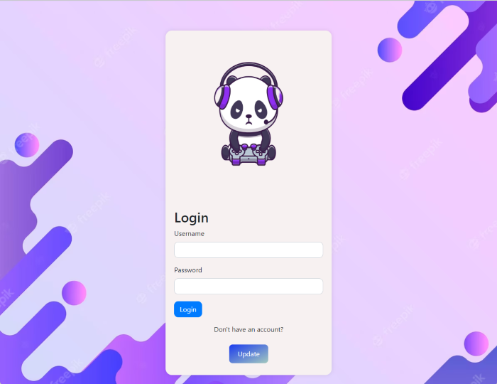

# Blog Project

#### In this project, I coded the backend part using .net 6 Web Api. I made CRUD operations for login and blog pages. I coded the frontend with Bootstrap & HTML #### & Css & JavaScript and linked them together with http protocol

